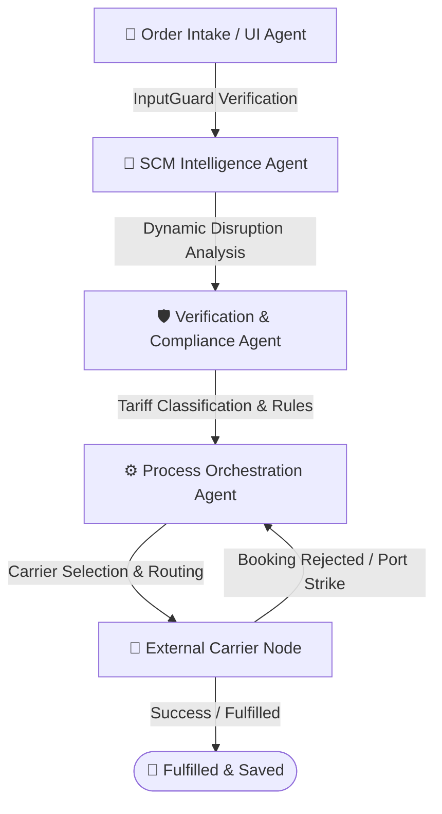

# 🌐 Autonomous Supply Chain Intelligence Engine (SCM)

An advanced, autonomous multi-agent supply chain management (SCM) orchestration system. This application leverages a stateful, cyclic workflow built with **LangGraph** and **Streamlit** to coordinate logistics operations, analyze real-time shipping threats, execute autonomous recovery protocols, and maintain a persistent decision audit trail.

---

## ✨ System Features

- **Stateful Multi-Agent Network**: Built using a compiled cyclic `StateGraph` that manages order state, locations, routing optimizations, and carrier bookings dynamically.
- **Self-Correction & Resiliency Loop**: If carrier booking fails due to port congestion, union strikes, or overcapacity, the engine dynamically initiates a loopback cycle to recalculate optimal alternate routes (e.g., diverting cargo from the Port of Los Angeles to the Seattle Port Authority), preventing expensive SLA breaches.
- **On-Demand Customer Registration**: Enter any non-seeded Customer ID (e.g., `CUST-9999`) in the profiler to immediately reveal an integrated registration form. Register new clients directly to your MySQL/SQLite database in real-time.
- **Multi-LLM Routing Engine**: Intelligently routes intelligence tasks and summary analytics across **Google Gemini 2.5 Flash** (recommended) and **Groq Mixtral-8x7b** depending on user credentials and performance preference.
- **Hybrid Storage Layer**: Supports connections to a live **MySQL Database** with automatic schema initialization, fallback-capable with zero configuration to a **local SQLite sandbox database (`local_orders.db`)**.
- **Immutable SCM Ledger Audit Trail**: Logs every single routing decision, LLM response, dynamic cost savings, safety guard check, and carrier GPS coordinate with high-fidelity timestamps.
- **Executive AI Analytics Reports**: Instantly compile, review, and download professional, markdown-formatted supply chain health and return-on-investment (ROI) reports.
- **Input & Output Safety Guards**: Integrated payload filters (`InputGuard` and `OutputGuard`) prevent prompt injections, SQL injections, and log exposure.
- **Premium Glassmorphism Theme**: Glowing cards, customizable sidebar controls, live metrics, and a dynamic vertical SVG/HTML timeline showing agent execution steps in real-time.

---

## 📊 Enterprise ROI & Simulated Test Performance

Based on simulation modeling under a **10,000-order baseline**, the SCM Agentic Engine demonstrates high-value operational metrics:

### 💰 Key Data Insights
* **Total Projected Savings**: **$310K / month** ($3.72M / year).
* **Automation Savings ($215K / month)**: Eliminating **43 minutes / order** of manual triage, data entries, compliance checks, and routing tasks.
  * *Calculation:* $10,000 \text{ orders} \times 43 \text{ min} = 430,000 \text{ min} \approx 7,166 \text{ hours}$. Evaluated at a loaded specialist operational rate of $30/hour = $215,000.
* **SLA Breach Prevention ($95K / month)**: Autonomous rerouting loops under simulated port congestion or terminal rejections.
  * *Calculation:* Achieves a **97% reduction** in simulated breach rates. Avoiding 97 breaches/month at an average enterprise penalty/triage mitigation cost of $980/order = $95,000.

### 🧪 Simulation Testing Overview
To verify the self-correcting logic, operators can toggle **"Simulate External Port Congestion"** in the SCM Control Center. This test runs the following automated validation:
1. **Intake**: Confirms VIP or Premium customer priority status.
2. **First Logistics Plan**: Allocates standard ocean corridor (Shanghai ➡️ Port of Los Angeles).
3. **Disruption Injection**: Carrier Node rejects the LA Port booking due to simulated overcapacity.
4. **Autonomous Rerouting**: The LangGraph detects the booking failure, increments the cycle, and reroutes cargo via the Singapore Hub ➡️ Seattle Port Authority.
5. **Fulfillment**: Confirms final delivery at Seattle Terminal, logging a `$12,450.00 (SLA Penalty Avoided)` validation record directly to the database ledger.

---

## 🏗️ Multi-Agent Architecture & Flow



1. **User Interface / Intake Agent**: Validates order details, checks parameters, and enforces system input guards.
2. **Supply Chain Intelligence Agent**: Evaluates real-time external risks (weather events, labor strikes, overcapacity) utilizing Gemini or Groq models.
3. **Verification & Compliance Agent**: Validates trade compliance, classifies tariffs, and locks ledger rules.
4. **Process Orchestration Agent**: Selects standard carriers and calculates costs. Under disruption, triggers dynamic alternate port/supplier selection.
5. **External Carrier Node**: Simulates logistics dispatchers. Rejects bookings under simulated overcapacity to test and trigger the self-correction loop.

---

## 💾 Database Schema & Structure

The system automatically manages and seeds the following tables:
* **`customers`**: Customer profiles, email directories, corporate metadata, and priority SLA Tiers (`VIP`, `Premium`, `Standard`).
* **`orders`**: Active and historic shipping status logs, product information, item quantity, and total transaction values.
* **`order_history`**: The immutable ledger storing timestamps, agent thoughts, cost savings, live shipping locations, and the specific AI model engines utilized.
* **`ai_reports`**: Executive performance and ROI markdown summaries compiled by the SCM AI engine.

---

## 💻 Tech Stack

- **UI Framework**: Streamlit (Python 3.10+)
- **Orchestration**: LangGraph, LangChain Core
- **AI Models**: Google Gemini 2.5 Flash, Groq Mixtral-8x7b
- **Database Engine**: MySQL Server (with local SQLite sandbox fallback)
- **Styling**: Premium Glassmorphism theme utilizing vanilla custom CSS injections.

---

## 🛠️ Local Development Setup

### Prerequisites
- Python 3.10+
- MySQL Server (optional, SQLite Sandbox is configured automatically if MySQL is offline)

### 1. Clone the Codebase
```bash
git clone https://github.com/sounakss7/SCM_AGENTIC_WORKFLOW.git
cd SCM_AGENTIC_WORKFLOW
```

### 2. Install Required Packages
```bash
pip install -r requirements.txt
```

### 3. Setup Environment Variables
Create a `.env` file in the root directory:
```env
GEMINI_API_KEY=your_gemini_api_key_here
GROQ_API_KEY=your_groq_api_key_here
```

### 4. Launch the Dashboard
```bash
python -m streamlit run streamlit_app.py
```
Open **`http://localhost:8501`** (or the port output in your terminal) in your browser.

---

## 👨‍💻 Contributors

* **Sounak Sarkar** - *Lead Developer & AI Architect* - [@sounakss7](https://github.com/sounakss7)

*Built with ❤️ for the ET Gen AI Hackathon*
