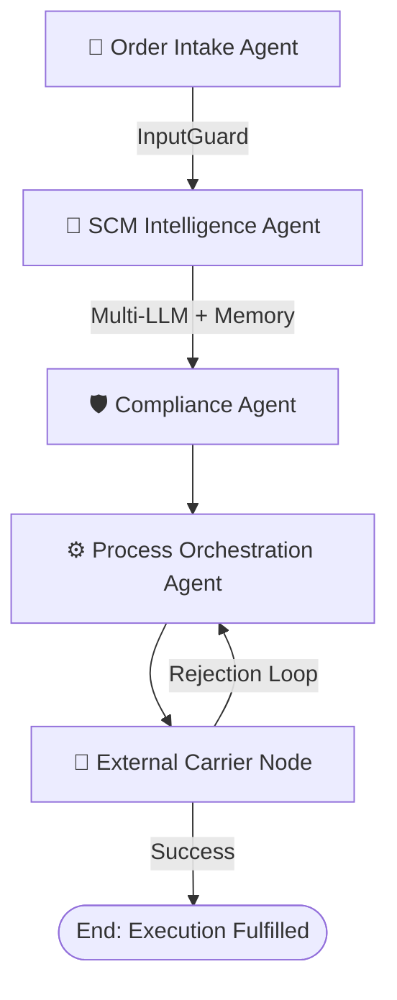

# 🌐 Autonomous Supply Chain Intelligence Engine (SCM)

An advanced, autonomous multi-agent supply chain management system. This platform leverages a state-of-the-art AI agent architecture built with **LangGraph** and **Streamlit** to orchestrate supply chain operations, detect disruptions in real-time, and execute autonomous recovery strategies.

---

## ✨ Features

- **Multi-Agent Orchestration:** Utilizes a stateful `StateGraph` architecture to coordinate multiple specialized AI agents.
- **Dynamic Disruption Mitigation:** Employs regional weather and strike alert analyzers to identify external threats and trigger dynamic rerouting.
- **Self-Correction & Resiliency Loop:** If a carrier booking is rejected due to port overcapacity or strikes, the engine automatically triggers alternative supplier selection and port diversions, saving thousands in SLA breach penalties.
- **Multi-LLM Routing:** Intelligently routes decision-making tasks across leading models (**Google Gemini 2.5 Flash** and **Groq Mixtral**) for optimized performance and cost.
- **Persistent Storage Layer**: Connects directly to a **MySQL Database** (or local SQLite sandbox) to log order states, carrier coordinates, and step-by-step agent thoughts.
- **Executive AI Analytics Reports**: Instantly compile, display, and download high-fidelity supply chain health and ROI performance reports.
- **Input & Output Safety Guards**: Integrated regex inspectors (`InputGuard` & `OutputGuard`) prevent SQL injections, prompt injections, or critical log leaks.

---

## 🏗️ Multi-Agent Architecture



1. **User Interface / Intake Agent**: Validates order details and runs payload safety guards.
2. **Supply Chain Intelligence Agent**: Analyzes global disruptions and checks historical vector memory for solutions using Gemini/Groq.
3. **Verification & Compliance Agent**: Validates tariff classifications and international compliance directives, locking down the transaction audit ledger.
4. **Process Orchestration Agent**: Selects standard carriers. Under disruption, triggers dynamic alternate port/supplier selection.
5. **External Entities simulation**: Simulates third-party logistics dispatchers. Rejects bookings under simulated overcapacity to trigger the self-correction loop.

---

## 💻 Tech Stack

- **UI Framework:** Streamlit (Python)
- **Agent Framework:** LangGraph, LangChain
- **LLM Models:** Google Gemini 2.5 Flash, Groq Mixtral-8x7b
- **Database Engine:** MySQL Server (with local SQLite sandbox fallback)
- **Styling:** Custom Vanilla CSS for glassmorphism, responsive metrics, and dynamic vertical timelines.

---

## 🛠️ Local Development Setup

### Prerequisites
- Python 3.10+
- MySQL Server (optional, sandbox SQLite is built-in)

### 1. Clone the Repository
```bash
git clone https://github.com/sounakss7/SCM_AGENTIC_WORKFLOW.git
cd SCM_AGENTIC_WORKFLOW
```

### 2. Install Dependencies
```bash
pip install -r requirements.txt
```

### 3. Run the Application
```bash
python -m streamlit run streamlit_app.py
```
Open **`http://localhost:8501`** (or the port specified in terminal) in your browser.

---

## 💾 Database Schema

The application manages the following tables in your MySQL/SQLite database:
* **`customers`**: Client profiles, contact logs, and priority SLA Tiers (`VIP`, `Premium`, `Standard`).
* **`orders`**: Active cargo bookings, items, values, and tracking states.
* **`order_history`**: The immutable ledger containing timestamps, agent thoughts, actions, and locations.
* **`ai_reports`**: Saved executive analytics summaries.

---

## 👨‍💻 Contributors

* **Sounak Sarkar** - *Lead Developer & AI Architect* - [@sounakss7](https://github.com/sounakss7)

*Built with ❤️ for the ET Gen AI Hackathon*
