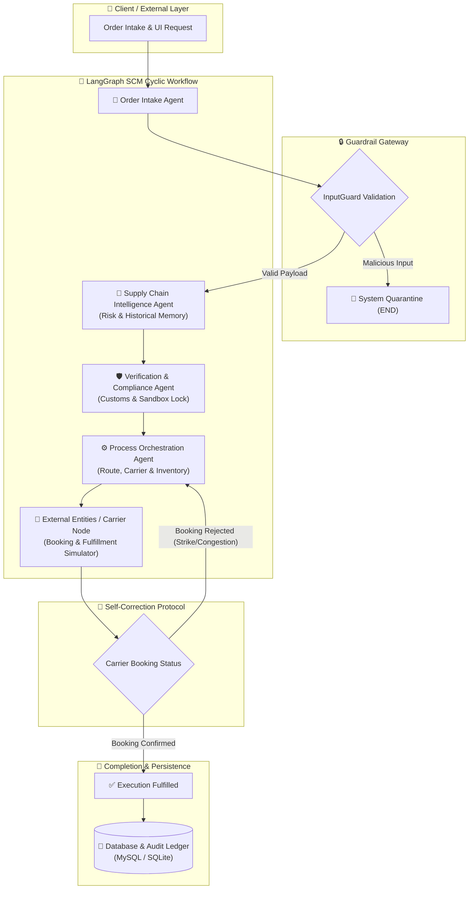

<div align="center">

# 🌐 Autonomous Supply Chain Intelligence Engine (SCM)

**Enterprise-Grade Autonomous Multi-Agent Logistics Orchestration & Self-Healing Supply Chain Network**

[](https://www.python.org/)
[](https://github.com/langchain-ai/langgraph)
[](https://streamlit.io/)
[](https://ai.google.dev/)
[](https://groq.com/)
[](https://www.mysql.com/)
[](LICENSE)

<br/>


</div>

---

## 📌 Executive Summary

The **Autonomous Supply Chain Intelligence Engine** is a resilient, multi-agent AI orchestration platform engineered to automate global logistics operations, detect external supply chain disruptions in real-time, enforce international trade compliance, execute dynamic self-correction and rerouting loops, and maintain an immutable decision audit trail.

Built with **LangGraph** stateful cyclic graphs and a high-performance **Streamlit** control center, the system continuously analyzes maritime lanes, supplier inventory, tariff classifications, and carrier bookings. When external anomalies arise (e.g., port strikes or container terminal overcapacity), the engine triggers an autonomous feedback loop to divert cargo to alternate hubs, preventing costly SLA breaches.

---

## 🌟 Core System Highlights

| Feature | Description |
| :--- | :--- |
| 🧠 **Stateful Multi-Agent Network** | Compiled cyclic `StateGraph` managing order lifecycle, geo-coordinates, routing optimizations, and carrier dispatching. |
| 🔄 **Self-Correction & Resiliency Loop** | Dynamic feedback loop that detects rejected bookings (e.g., Port of LA strike) and recalculates alternative routes (e.g., Singapore Hub ➡️ Seattle Port Authority). |
| 🛡️ **Dual-Layer Guardrails** | `InputGuard` intercepts prompt injections, SQL injections (`UNION SELECT`, `OR 1=1`), and XSS payloads; `OutputGuard` sanitizes LLM responses. |
| ⚡ **Multi-LLM Adaptive Router** | Intelligent switching between **Google Gemini 2.5 Flash** (recommended) and **Groq Mixtral-8x7b-32768**, backed by deterministic zero-downtime offline fallbacks. |
| 💾 **Hybrid Storage Architecture** | Enterprise **MySQL Server** support with instant, zero-configuration automatic fallback to an isolated **SQLite Sandbox (`local_orders.db`)**. |
| 📜 **Immutable Ledger Audit Trail** | High-fidelity logging of every agent decision, LLM response, dynamic cost savings calculation, and carrier location. |
| 📄 **Executive AI Reports** | One-click compilation of comprehensive, markdown-formatted supply chain health and ROI reports with instant download. |
| 👤 **On-Demand Customer Profiling** | Instant client lookup with integrated registration forms for dynamic enterprise onboarding. |

---

## 🏗️ Multi-Agent Architecture



### Agent Roles & Responsibilities

1. **👤 User Interface / Order Intake Agent**: Validates order parameters, verifies customer priority tiers (`VIP`, `Premium`, `Standard`), and enforces payload sanitization via `InputGuard`.
2. **🧠 Supply Chain Intelligence Agent**: Analyzes live shipping threats (typhoons, port strikes, geopolitical bottlenecks) against historical memory and recommends corrective actions.
3. **🛡️ Verification & Compliance Agent**: Enforces international trade rules, validates tariff classification filings, and locks the compliance audit state.
4. **⚙️ Process Orchestration Agent**: Selects optimal shipping lanes, calculates carrier pricing, and reserves regional inventory. Under disruption, allocates alternative hubs and suppliers.
5. **🚢 External Entities / Carrier Node**: Simulates real-time dispatcher confirmations and tests the self-healing feedback cycle under simulated terminal congestion.

---

## 💰 Enterprise ROI & Impact Metrics

Modeled on a standard enterprise baseline of **10,000 shipments / month**:

```
┌─────────────────────────────────────────────────────────────────────────────┐
│                       MONTHLY PROJECTED SAVINGS: $310,000                   │
│                        ANNUAL VALUE GENERATED: $3.72M                       │
└─────────────────────────────────────────────────────────────────────────────┘
```

* **⚡ Automation Savings ($215,000 / month)**: Eliminates an average of **43 minutes / order** of manual triage, data entry, compliance review, and carrier dispatching.
  $$\text{Savings} = 10{,}000 \text{ orders} \times \frac{43 \text{ min}}{60 \text{ min/hr}} \times \$30/\text{hr} = \$215{,}000/\text{month}$$
* **🛡️ SLA Penalty Mitigation ($95,000 / month)**: Autonomous rerouting loops achieve a **97% reduction** in breach rates during port strikes or terminal congestion.
  $$\text{Mitigated Loss} = 97 \text{ avoided breaches} \times \$980 \text{ avg. penalty} = \$95{,}000/\text{month}$$

---

## 🗄️ Database Architecture

The system features automatic schema creation and seeding for both **MySQL** and **SQLite**:

```
customers ─────────────┐
(customer_id, tier, ...) │ 1:N
                       ├────── orders (order_id, product_name, quantity, total_price, status)
                       │          │
                       │          │ 1:N
                       │          └────── order_history (id, order_id, phase, agent_name, action, savings, live_location)
                       │
                       └────── ai_reports (id, customer_id, report_text, model_used, created_at)
```

### Table Definitions

* **`customers`**: Stores corporate profiles, contact directories, shipping addresses, and SLA priority tiers (`VIP`, `Premium`, `Standard`).
* **`orders`**: Active and historical order details, product catalogs, volumes, and execution statuses.
* **`order_history`**: The immutable ledger recording timestamps, agent actions, LLM reasoning, live coordinates, and cost savings.
* **`ai_reports`**: Markdown-formatted executive performance and quarterly strategy reports.

---

## 💻 Tech Stack

* **Framework & UI**: [Streamlit](https://streamlit.io/) (1.45+) with Vanilla Glassmorphic CSS
* **Workflow Orchestration**: [LangGraph](https://github.com/langchain-ai/langgraph), [LangChain Core](https://github.com/langchain-ai/langchain)
* **AI & LLM Inference**: [Google Gemini 2.5 Flash](https://ai.google.dev/), [Groq](https://groq.com/) (Mixtral-8x7b-32768)
* **Storage & Persistence**: [PyMySQL](https://github.com/PyMySQL/PyMySQL), SQLite3, [Cryptography](https://cryptography.io/)
* **Configuration & Security**: [Python-Dotenv](https://github.com/theskumar/python-dotenv), Pydantic v2

---

## 🚀 Quick Start Guide

### Prerequisites
* **Python**: `3.10` or higher
* **Git** installed on your system
* *(Optional)* MySQL Server (SQLite sandbox runs out-of-the-box with zero setup)

### 1. Clone the Repository
```bash
git clone https://github.com/sounakss7/SCM_AGENTIC_WORKFLOW.git
cd SCM_AGENTIC_WORKFLOW
```

### 2. Set Up Virtual Environment & Dependencies
```bash
# Create virtual environment
python -m venv .venv

# Activate virtual environment
# Windows (PowerShell):
.venv\Scripts\Activate.ps1
# Linux / macOS:
source .venv/bin/activate

# Install required packages
pip install -r requirements.txt
```

### 3. Configure Environment Variables
Copy the sample environment file:
```bash
cp .env.example .env
```

Edit `.env` with your API credentials:
```env
# Google Gemini API Key (Recommended)
GEMINI_API_KEY="AIzaSyYourActualKeyGoesHere..."

# Groq API Key (Optional for Mixtral routing)
GROQ_API_KEY="gsk_YourGroqApiKeyHere..."

# Storage configuration (Defaults to SQLite sandbox)
USE_SQLITE="true"
```

### 4. Run Automated Test Suite
Verify that all guardrails, database operations, and agent workflows are operational:
```bash
python test_runner.py
```

### 5. Launch the SCM Dashboard
```bash
streamlit run streamlit_app.py
```

Navigate to **`http://localhost:8501`** in your browser.

---

## 🧪 Testing the Resiliency Loop

To verify the autonomous self-correction mechanism in action:

1. On the **📈 SCM Control Center** tab, select customer **`CUST-1002`** (Sarah Chen / Global Logistics Corp).
2. Select active order **`ORD-5003`** (or create a new order).
3. Toggle **"💥 Simulate External Port Congestion (SLA Risk)"**.
4. Click **"🚀 Execute Multi-Agent Workflow"**.
5. Observe the live execution timeline:
   * **Cycle 0**: Carrier Node rejects the initial booking at Port of Los Angeles due to simulated overcapacity.
   * **Cycle 1**: LangGraph triggers the loopback to `orchestration_agent`, recalculating the route via Singapore Hub ➡️ Seattle Port Authority.
   * **Resolution**: Final booking confirmed at Seattle Terminal with **$12,450.00** logged in prevented SLA penalties.

---

## 🔒 Security & Safety Controls

* **Injection Guard**: Strict regex patterns detect and quarantine prompt injection attempts and SQL injection signatures (`UNION SELECT`, `DROP TABLE`, `OR 1=1`, `<script>`).
* **Quarantine Short-Circuit**: Quarantined requests immediately terminate at `ui_agent` and route directly to `END`, preventing unauthorized LLM token consumption.
* **Response Sanitization**: `OutputGuard` validates all generated responses before committing records to the audit ledger.

---

## 📁 Repository Structure

```
SCM_AGENTIC_WORKFLOW/
├── agents/
│   ├── guards.py                 # InputGuard & OutputGuard security layer
│   ├── nodes.py                  # Multi-agent node implementations & LLM loaders
│   └── workflow.py               # Compiled LangGraph StateGraph & conditional routers
├── database/
│   └── db_manager.py             # Hybrid MySQL/SQLite driver, schema init & seed data
├── ui/
│   ├── scm_logo.png              # SCM dashboard branding asset
│   └── styles.py                 # Custom Glassmorphic Dark CSS & SVG timeline renderer
├── .env.example                  # Environment variable configuration template
├── .gitignore                    # Git ignore definitions
├── LICENSE                       # MIT License
├── README.md                     # Project documentation
├── requirements.txt              # Production dependency specifications
├── SCM_Architecture_Workflow.png # Architecture & workflow visual diagram
├── streamlit_app.py              # Main dashboard application & tab controllers
└── test_runner.py                # Automated test runner suite
```

---

## 📄 License

This project is licensed under the **MIT License** - see the [LICENSE](LICENSE) file for details.

---

## 👨‍💻 Author & Contributions

* **Sounak Sarkar** - *AI Engineer & Lead Architect* - [@sounakss7](https://github.com/sounakss7)

*Developed for the Economic Times (ET) GenAI Hackathon & Enterprise SCM Automation.*
