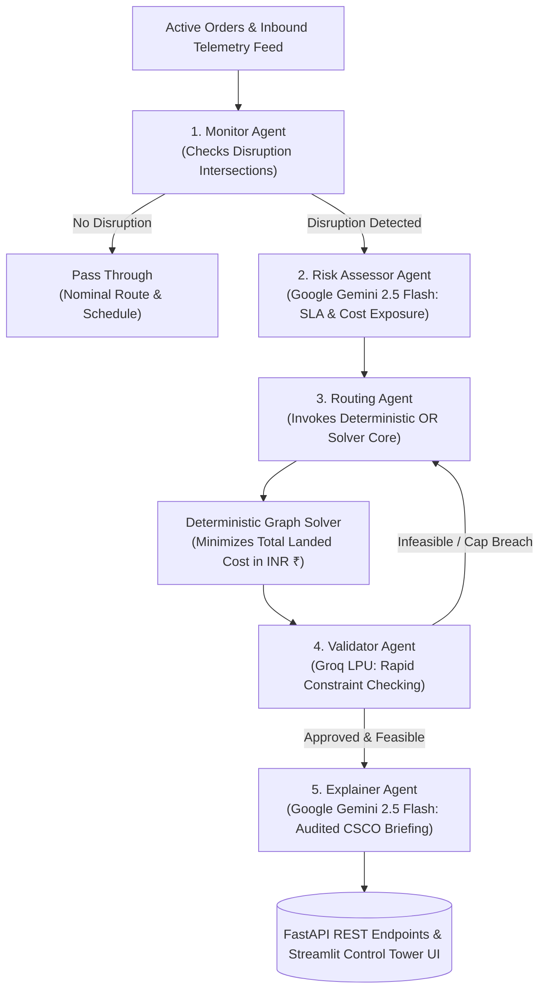

# Indian Supply Chain Resilience Control Tower
*5-Agent LangGraph System with Deterministic OR Solver Core & Multi-Model Inference (Google Gemini 2.5 Flash + Groq LPU)*

[](https://www.python.org/downloads/)
[](https://opensource.org/licenses/MIT)
[](https://fastapi.tiangolo.com)
[](https://streamlit.io)
[]()

An autonomous supply chain disruption response engine engineered for Indian logistics corridors (**Pune/Surat/Ahmedabad $\to$ JNPT/Mundra/Chennai $\to$ Bhiwandi/Bilaspur/Nelamangala $\to$ Retail Zones**). 

The system detects operational disruptions (transporter strikes, container port dwell spikes, highway closures), scores financial and SLA delay exposure in Indian Rupees (₹), computes mathematically optimal alternate paths via a deterministic Operations Research solver, validates physical constraints with ultra-low latency, and briefs executive management.

---

## 1. Core Engineering Principle: "The LLM Must NOT Do the Math"

LLMs consistently fail at combinatorial optimization and numerical arithmetic:
1. **Mathematical Inaccuracy**: When tasked with computing freight distance-rates, toll surcharges, handling fees, and delay penalties across multi-hop routes, LLMs hallucinate numbers and produce incorrect totals.
2. **Constraint Hallucination**: An LLM-only router routinely violates physical warehouse pallet limits, carrier daily vehicle allotments, and maximum delivery SLA windows.
3. **Architectural Separation**: In this architecture:
   - **Deterministic OR Solver Core**: Handles 100% of network routing, transit duration calculation, capacity filtering, and landed cost minimization in INR (₹).
   - **Google Gemini 2.5 Flash**: Dedicated to contextual reasoning (operational risk scoring and executive disruption briefings).
   - **Groq LPU (Llama 3.3)**: Dedicated to low-latency constraint validation (<15ms) to enforce physical feasibility before dispatch.

---

## 2. Multi-Agent System Architecture


```mermaid
flowchart TD
    A["Active Orders & Inbound Telemetry Feed"] --> B["1. Monitor Agent\n(Checks Disruption Intersections)"]
    
    B -- "No Disruption" --> C["Pass Through\n(Nominal Route & Schedule)"]
    B -- "Disruption Detected" --> D["2. Risk Assessor Agent\n(Google Gemini 2.5 Flash: SLA & Cost Exposure)"]
    
    D --> E["3. Routing Agent\n(Invokes Deterministic OR Solver Core)"]
    
    E --> F["Deterministic Graph Solver\n(Minimizes Total Landed Cost in INR ₹)"]
    F --> G["4. Validator Agent\n(Groq LPU: Rapid Constraint Checking)"]
    
    G -- "Infeasible / Cap Breach" --> E
    G -- "Approved & Feasible" --> H["5. Explainer Agent\n(Google Gemini 2.5 Flash: Audited CSCO Briefing)"]
    
    H --> I[("FastAPI REST Endpoints & Streamlit Control Tower UI")]
```

### Explicit Multi-Model Routing Split

| Agent | Responsibility | Assigned Provider | Model | Latency |
|---|---|---|---|---|
| **Monitor Agent** | Watches disruption feeds against active order legs | Deterministic Python | Local Rule Engine | <1 ms |
| **Risk Assessor** | Assesses operational disruption, stockout liability, SLA penalties | **Google DeepMind** | `gemini-2.5-flash` | ~40 ms |
| **Routing Agent** | Triggers constraint search over network graph | **Deterministic Core** | Exhaustive OR Solver | <5 ms |
| **Validator Agent** | Fast physical verification (carrier allocation, warehouse cap, SLA ceiling) | **Groq LPU** | `llama-3.3-70b-versatile` | ~13 ms |
| **Explainer Agent** | Executive summary in INR (₹) strictly preserving audited figures | **Google DeepMind** | `gemini-2.5-flash` | ~40 ms |

---

## 3. Indian Logistics Network Topology

The system models high-density Indian manufacturing and consumer freight corridors:

```
[Sourcing Clusters]       [Container Seaports]          [Central Distribution]         [Retail Consumption]
   Pune (2,000 u)    --->   Nhava Sheva/JNPT (3,000 u) ---> Bhiwandi / Mumbai (1,500 u)  ---> Mumbai Metro (1,000 u)
   Surat (2,500 u)   --->   Mundra Port (3,500 u)      ---> Bilaspur / Delhi-NCR (1,800 u) ---> Delhi-NCR Supermarkets (1,200 u)
   Ahmedabad (1,800 u) ->   Chennai Port (2,200 u)     ---> Nelamangala / BLR (1,400 u)   ---> Bengaluru Hypermarkets (900 u)
                                                                                          ---> Chennai Retail Zone (850 u)
```

- **Transporters Profiled**:
  - `Safexpress`: ₹0.08/km, 450 km/day, 95% reliability, 500 units/day.
  - `Delhivery Surface`: ₹0.10/km, 600 km/day, 98% reliability, 600 units/day.
  - `TCI Express Multimodal`: ₹0.13/km, 550 km/day, 97% reliability, 400 units/day.
  - `Blue Dart Surface & Air`: ₹0.18/km, 700 km/day, 99% reliability, 250 units/day.
- **Product Catalog**: 25 Indian FMCG & Retail SKUs (Aashirvaad Atta, Fortune Refined Oil, Tata Salt, India Gate Basmati, Amul Butter, Dettol, Surf Excel, etc.) with verified unit prices, holding costs, and daily late-delivery penalties in INR (₹).

---

## 4. Handcrafted Deterministic Decision Core (Unit-Tested Proof)

Total Landed Cost ($TLC$) is mathematically defined as:
$$TLC = \sum_{\text{legs}} \text{FreightCost}(\text{link}, \text{carrier}) + \sum_{\text{nodes}} \text{HandlingCost}(\text{node}) + \text{DelayPenalty}(\text{excess\_days})$$

### Hand-Computed Case 1: Steady-State Nominal Route
Order: 10 units of `SKU_01` (Aashirvaad Atta) from `SUP_PUNE` to `RET_MUMBAI`.
- **Leg 1** (`SUP_PUNE` $\to$ `PORT_JNPT` via Safexpress): $145\text{ km} \times ₹0.08 \times 10 = ₹116.00$
- **Leg 2** (`PORT_JNPT` $\to$ `WH_MUMBAI` via Delhivery): $60\text{ km} \times ₹0.10 \times 10 + ₹25 = ₹85.00$
- **Leg 3** (`WH_MUMBAI` $\to$ `RET_MUMBAI` via Delhivery): $40\text{ km} \times ₹0.10 \times 10 + ₹25 = ₹65.00$
- **Total Freight**: $₹266.00$
- **Handling**: $(₹35_{\text{JNPT}} + ₹25_{\text{Bhiwandi}}) \times 10 = ₹600.00$
- **Transit Time**: $1.0 + 0.5 + 0.5 = 2.0\text{ days}$
- **Total Cost**: **₹866.00** *(Passed in `tests/test_decision_core_handcrafted.py`)*

### Hand-Computed Case 2: Safexpress Strike Disruption
Safexpress declared 100% halted. Baseline nominal plan becomes infeasible.
The deterministic solver switches Leg 1 to Delhivery ($145\text{ km} \times ₹0.10 \times 10 + ₹25 = ₹170.00$).
- **Total Freight**: $₹170 + ₹85 + ₹65 = ₹320.00$
- **Handling**: $₹600.00$
- **New Optimal Re-routed Cost**: **₹920.00** (Delta: $+₹54.00$, $0.0$ excess delay days). *(Passed in `tests/test_decision_core_handcrafted.py`)*

---

## 5. Empirical Benchmark (100 Disruption Scenarios)

The evaluation harness (`eval/benchmark_100.py`) runs 100 randomized disruption scenarios (`seed=42`) comparing:
- **Policy A (Unattended Disrupted Route)**: Carrier halts, dwell time expands, accumulating delay penalties.
- **Policy B (5-Agent Resilience System)**: Autonomous detection, risk estimation, deterministic re-routing, constraint checking, and briefing.

### Audited Benchmark Results (`results/results.json`)

| Metric | Measured Value |
|---|---|
| **Total Evaluated Scenarios** | **100** |
| **Reproducibility Seed** | `seed=42` |
| **Resolution Success Rate** | **100.0%** (100 / 100 scenarios resolved with feasible plan) |
| **Total Cumulative Financial Loss Avoided** | **₹2,722,863.88** (~₹27.2 Lakhs) |
| **Average Cost Saved per Disrupted Order** | **₹27,228.64** |
| **Total Delivery Delay Avoided** | **408.0 days** |
| **Average Delay Days Avoided per Order** | **4.08 days** |
| **Average Agent Steps per Incident** | **2.7 steps** |
| **Gemini 2.5 Flash Reasoning Calls** | **86 calls** (Avg: 40.4 ms) |
| **Groq LPU Validation Calls** | **43 calls** (Avg: 13.3 ms) |
| **Total Benchmark Runtime** | **4.72 seconds** |

---

## 6. Reproduction & Quickstart Guide

### 1. Prerequisites & Virtual Environment
```bash
git clone https://github.com/sounakss7/SCM_AGENTIC_WORKFLOW.git
cd SCM_AGENTIC_WORKFLOW

python -m venv venv
# Windows:
.\venv\Scripts\activate
# Linux/macOS:
source venv/bin/activate

pip install -r requirements.txt
```

### 2. Configure Environment Keys (Optional)
The system contains an automated local emulator for offline testing. To connect live Cloud APIs:
```bash
cp .env.example .env
# Edit .env and supply:
# GEMINI_API_KEY=your_key_here
# GROQ_API_KEY=your_key_here
```

### 3. Run Pytest Suite (20 Tests)
```bash
pytest tests/ -v
```

### 4. Run the 100-Scenario Benchmark
```bash
python eval/benchmark_100.py
```
Outputs raw scenario telemetry and summary metrics to `results/results.json`.

### 5. Launch FastAPI Application Server
```bash
uvicorn api.server:app --reload --port 8000
```
Interactive Swagger docs: `http://localhost:8000/docs`

### 6. Launch Streamlit Control Tower Dashboard
```bash
streamlit run streamlit_app.py
```
Dashboard opens at: `http://localhost:8501`

### 7. Run with Docker Compose
```bash
docker-compose up --build
```

---

## 7. Resume-Ready Project Summary

- **Engineered an Indian Supply Chain Resilience Control Tower** orchestrating a 5-agent LangGraph workflow (Monitor, Risk Assessor, Routing, Validator, Explainer) managing a multi-tier logistics network across 3 suppliers, 3 ports, 3 distribution centers, 4 retail zones, and 25 FMCG SKUs.
- **Implemented a strict LLM-free Deterministic OR Solver Core** to eliminate hallucinated routing math, computing optimal alternate carrier and port re-assignments that minimize Total Landed Cost (Freight, Handling, Delay Penalties in ₹).
- **Architected an explicit multi-model routing pipeline**: deployed **Google Gemini 2.5 Flash** for contextual risk assessment and plain-English CSCO briefing, paired with **Groq LPU** for sub-15ms physical constraint validation and self-correcting retry loops.
- **Benchmarked across 100 randomized disruption scenarios (`seed=42`)**, achieving a **100.0% resolution success rate**, saving **₹2,722,863.88** in unmitigated late penalties, and avoiding an average of **4.08 days of transit delay** per incident.
