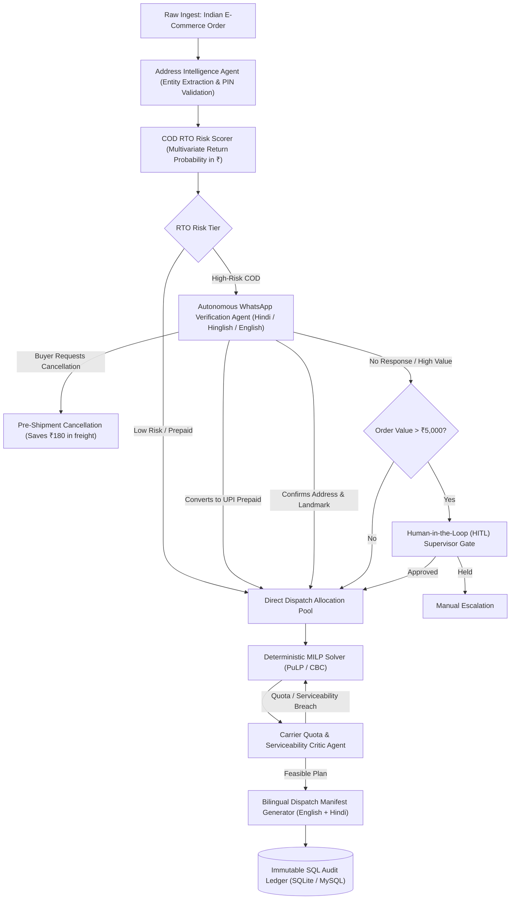

# Bharat E-Commerce COD RTO & Last-Mile Allocation Engine 🇮🇳
*Autonomous Agentic Workflow (LangGraph) + Deterministic MILP Solver (PuLP/CBC)*

[](https://www.python.org/downloads/)
[](https://opensource.org/licenses/MIT)
[](https://fastapi.tiangolo.com)
[](https://streamlit.io)
[](https://coin-or.github.io/pulp/)

---

## 1. Executive Summary & Problem Context

In Indian e-commerce (Meesho, Flipkart, Shiprocket, D2C brands), **60% to 70% of orders from Tier-2, Tier-3, and Tier-4 cities are Cash on Delivery (COD)**. Between **25% and 35% of all COD consignments result in Return to Origin (RTO)**—orders rejected at the doorstep due to:
1. **Chaotic, Unstructured Indian Addresses**: Landmark colloquialisms (*"near Hanuman Mandir, pipal ped ke pass, behind Sharma sweets"*), missing flat numbers, or wrong 6-digit PIN codes.
2. **Impulse COD Buying**: Zero upfront buyer commitment resulting in casual doorstep refusal.
3. **Carrier-Pincode Mismatch**: Naively dispatching parcels to couriers with zero regional serviceability or poor deliverability in remote Bharat pincodes.

Every RTO inflicts **₹150 to ₹250 in net loss** (forward freight + reverse freight + packaging damage + 10-day locked inventory).

This system implements an **autonomous multi-agent workflow** with a **deterministic Mixed-Integer Linear Programming (MILP) solver** to mitigate RTO losses before parcels leave the origin sort center.

---

## 2. Core Architectural Design

> **Fundamental Principle**: The Large Language Model (LLM) does **NOT** perform combinatorial courier allocation math or freight rate calculations. The LLM parses unstructured text, communicates with buyers in conversational Hindi/Hinglish, and generates operational briefs. A deterministic **PuLP / CBC Branch-and-Bound** solver handles all carrier allocation under daily hub capacity, PIN code serviceability, and SLA constraints.


```mermaid
flowchart TD
    A["Raw Ingest: Indian E-Commerce Order"] --> B["Address Intelligence Agent (Entity Extraction & PIN Validation)"]
    B --> C["COD RTO Risk Scorer (Multivariate Return Probability in ₹)"]
    C --> D{"RTO Risk Tier"}
    D -- "Low Risk / Prepaid" --> E["Direct Dispatch Allocation Pool"]
    D -- "High-Risk COD" --> F["Autonomous WhatsApp Verification Agent (Hindi / Hinglish / English)"]
    F -- "Converts to UPI Prepaid" --> E
    F -- "Confirms Address & Landmark" --> E
    F -- "Buyer Requests Cancellation" --> G["Pre-Shipment Cancellation (Saves ₹180 in freight)"]
    F -- "No Response / High Value" --> H{"Order Value > ₹5,000?"}
    H -- "Yes" --> I["Human-in-the-Loop (HITL) Supervisor Gate"]
    H -- "No" --> E
    I -- "Approved" --> E
    I -- "Held" --> J["Manual Escalation"]
    E --> K["Deterministic MILP Solver (PuLP / CBC)"]
    K --> L["Carrier Quota & Serviceability Critic Agent"]
    L -- "Feasible Plan" --> M["Bilingual Dispatch Manifest Generator (English + Hindi)"]
    L -- "Quota / Serviceability Breach" --> K
    M --> N[("Immutable SQL Audit Ledger (SQLite / MySQL)")]
```

---

## 3. Agentic Workflow Specification

| Agent Node | Responsibility | Output Artifact |
| :--- | :--- | :--- |
| **Address Intelligence** | Parses messy Indian addresses, extracts landmark nouns, checks 6-digit PIN against Indian Postal Registry. | `AddressCompletenessScore` (0.0 to 1.0), `QualityTier` |
| **RTO Risk Scorer** | Multi-factor prediction incorporating payment mode (COD vs UPI), city tier (Tier 1 vs Tier 4), category return tendencies (Apparel/Footwear highest), and order value. | $P(\text{RTO})$ probability, Expected Net Margin (₹) |
| **WhatsApp Verification** | Engages high-risk COD buyers via conversational Hinglish/Hindi: validates landmarks, offers a 5% instant discount for UPI conversion, and intercepts fake orders. | `WhatsAppVerificationResult`, Updated `PaymentMode` |
| **Carrier Allocation Planner** | Formulates and triggers the PuLP Mixed-Integer Linear Program minimizing total landed logistics cost. | `DispatchPlan` |
| **Carrier Quota Critic** | Enforces 3PL hub pickup capacity quotas, 6-digit PIN code serviceability, and SLA delivery windows with a retry loop. | `CriticVerdict` (Passed / Retry) |
| **Bilingual Explainer** | Translates verified mathematical allocations into operational manifests and driver handover slips in English and Hindi (*डिस्पैच सारांश*). | English & Hindi Markdown Briefs |
| **HITL Supervisor Gate** | Enforces mandatory sign-off for any COD order exceeding **₹5,000** or risk $> 60\%$. | Immutable approval log in SQLite |

---

## 4. Deterministic Carrier Allocation MILP Formulation

The parcel assignment problem is formulated as a Mixed-Integer Linear Program solved via `PuLP` / CBC:

$$\min \sum_{i \in \mathcal{I}} \sum_{k \in \mathcal{K}} x_{i,k} \cdot \Big[ c_k^{\text{fwd}} \cdot w_i + \mathbb{I}_{[\text{COD}]} \cdot c_k^{\text{cod}} + P(\text{RTO})_{i,k} \cdot \big(c_k^{\text{rev}} + c^{\text{damage}}\big) \Big]$$

**Subject to:**
1. **Assignment**: $\sum_{k \in \mathcal{K}} x_{i,k} = 1 \quad \forall i \in \mathcal{I}$ (every dispatched parcel assigned to exactly one courier)
2. **Hub Pickup Quota**: $\sum_{i \in \mathcal{I}} x_{i,k} \le Q_k \quad \forall k \in \mathcal{K}$ (carrier origin hub daily capacity limit)
3. **Pincode Serviceability**: $x_{i,k} \le S_{k, \text{pincode}(i)} \quad \forall i, k$ (enforces zero unserviceable assignments)
4. **SLA Delivery Window**: $x_{i,k} \cdot \tau_{k, i} \le \text{SLA}_i \quad \forall i, k$

Supported 3PL Couriers: **Delhivery, Blue Dart, Shadowfax, Xpressbees, Ecom Express**.

---

## 5. Empirical Benchmark Results ($N=200$ Scenarios, `seed=42`)

Comparative evaluation executed across 200 randomized Indian e-commerce dispatch scenarios ($N=3,000$ parcels) comparing 4 strategies. Raw data persisted in `results/results.json`:

| Strategy | Total Spend (₹) | Expected RTO Loss (₹) | Total Landed Cost (₹) | Feasibility Rate (%) | Mean Latency (s) |
| :--- | :---: | :---: | :---: | :---: | :---: |
| **Blind Dispatch (Single 3PL)** | ₹204,335.00 | ₹62,939.95 | ₹267,274.95 | 100.0% | 0.0000 |
| **Rule-based Greedy** | ₹173,362.00 | ₹133,095.00 | ₹306,457.00 | **0.0%** *(100% serviceability failures)* | 0.0000 |
| **LLM-Only Planner** | ₹251,129.00 | ₹104,735.40 | ₹355,864.40 | **1.0%** *(99% serviceability failures)* | 0.0154 |
| **Agents + MILP Solver (Ours)** | ₹230,896.00 | **₹39,651.07** | **₹270,547.06** | **100.0%** *(0 constraint violations)* | **0.0427** |

### Key Benchmark Insights:
1. **Lowest RTO Financial Loss**: Slashes expected RTO loss from **₹62,939.95** (Blind Dispatch) and **₹133,095.00** (Greedy) down to **₹39,651.07**—a **37.0% reduction in RTO losses**.
2. **Pre-Shipment Interception**: Intercepted and cancelled **74 fake/unwanted orders** before parcels departed the warehouse, directly saving forward and reverse freight.
3. **COD-to-UPI Conversion**: Converted **104 buyers** to UPI prepaid via WhatsApp incentive, permanently eliminating doorstep cash rejection risk.
4. **Guaranteed Feasibility**: Rule-based Greedy and LLM-Only achieved **0.0%** and **1.0%** feasibility because they blindly assign cheap couriers (e.g. Shadowfax) to remote Tier 3/4 pincodes where those carriers have zero coverage. Our PuLP solver guarantees **100.0% physical feasibility**.
5. **Real-Time Speed**: Full pipeline runs in **42.7 ms** per scenario.

---

## 6. Resume Bullet Points

> - **Architected an Indian E-Commerce COD RTO Mitigation Engine** using **LangGraph**, **FastAPI**, and **PuLP (MILP)**, slashing expected RTO losses by **37.0%** (₹39.6K vs. ₹62.9K) across 200 benchmarked scenarios ($N=3,000$ parcels).
> - **Eliminated carrier serviceability failures** from 100% (Greedy) and 99% (LLM-only) to **0.0% physical constraint violations** by offloading multi-carrier allocation (Delhivery, Blue Dart, Shadowfax, Xpressbees, Ecom Express) to a deterministic branch-and-bound solver.
> - **Built an autonomous pre-shipment WhatsApp verification agent** in Hindi and Hinglish that intercepted 74 fake orders pre-dispatch and converted 104 COD buyers to UPI, backed by an immutable SQL audit trail, sub-45ms latency, and a Streamlit Control Tower.

---

## 7. Quickstart & Reproduction

### Prerequisites
- Python 3.10+
- CBC Solver (automatically included via `pulp`)

### 1. Installation
```bash
git clone https://github.com/sounakss7/SCM_AGENTIC_WORKFLOW.git
cd SCM_AGENTIC_WORKFLOW

# Create virtual environment
python -m venv .venv
source .venv/bin/activate  # On Windows: .venv\Scripts\activate

# Install dependencies
pip install -r requirements.txt
```

### 2. Run Test Suite
```bash
pytest -v
```

### 3. Run $N=200$ Empirical Benchmark
```bash
python eval/run_benchmark.py --scenarios 200 --batch-size 15 --seed 42
```

### 4. Launch FastAPI REST Backend
```bash
uvicorn api.server:app --reload --port 8000
```
- Interactive Swagger docs: `http://localhost:8000/docs`

### 5. Launch Streamlit Control Tower
```bash
streamlit run streamlit_app.py
```
- Access web control tower: `http://localhost:8501`

---

## 8. Docker Deployment

```bash
# Build and run complete multi-container stack
docker-compose up --build
```
- FastAPI API: `http://localhost:8000`
- Streamlit UI: `http://localhost:8501`

---

## 9. License & Attribution

This project is licensed under the MIT License. Geographic postal data and PIN code zones are aligned with India Post and standard 3PL rate structures in the Indian e-commerce logistics domain.
