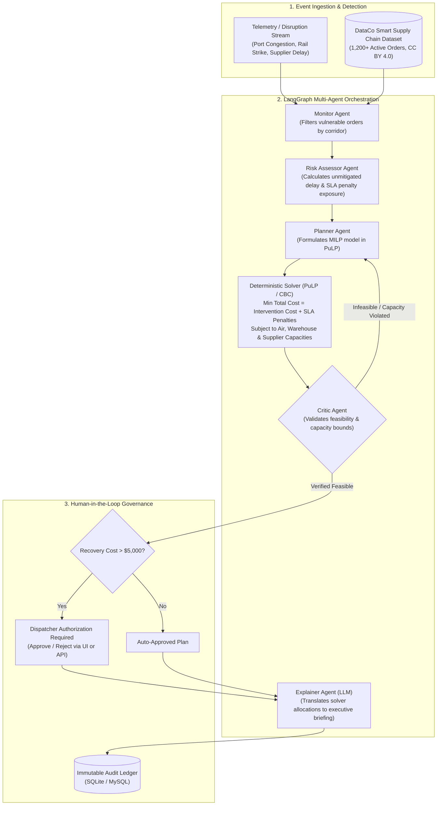

# Supply Chain Disruption Response Engine

A multi-agent supply chain disruption response system built with LangGraph, a deterministic Mixed-Integer Linear Programming (MILP) solver (PuLP/CBC), and Google Gemini / Groq.

When disruptions hit (port congestion, carrier failures, supplier delays, demand spikes), the agent system detects the event, scores order vulnerability, formulates candidate recovery actions, and executes an operations research solver to find the mathematically optimal recovery plan under physical capacity and budget constraints.

**Architectural Principle**: The LLM does not perform arithmetic or combinatorial optimization. The solver computes allocations and costs; the LLM handles perception, structured translation, and plain-English operational explanations.

---

## Architecture


```mermaid
flowchart TD
    subgraph Ingestion ["1. Event Ingestion & Detection"]
        E1["Telemetry / Disruption Stream\n(Port Congestion, Rail Strike, Supplier Delay)"]
        D1[("DataCo Smart Supply Chain Dataset\n(1,200+ Active Orders, CC BY 4.0)")]
    end

    subgraph LangGraph ["2. LangGraph Multi-Agent Orchestration"]
        M["Monitor Agent\n(Filters vulnerable orders by corridor)"]
        R["Risk Assessor Agent\n(Calculates unmitigated delay & SLA penalty exposure)"]
        P["Planner Agent\n(Formulates MILP model in PuLP)"]
        S["Deterministic Solver (PuLP / CBC)\nMin Total Cost = Intervention Cost + SLA Penalties\nSubject to Air, Warehouse & Supplier Capacities"]
        C{"Critic Agent\n(Validates feasibility & capacity bounds)"}
        EX["Explainer Agent (LLM)\n(Translates solver allocations to executive briefing)"]
    end

    subgraph Governance ["3. Human-in-the-Loop Governance"]
        G{"Recovery Cost > $5,000?"}
        HITL["Dispatcher Authorization Required\n(Approve / Reject via UI or API)"]
        AUTO["Auto-Approved Plan"]
        AL[("Immutable Audit Ledger\n(SQLite / MySQL)")]
    end

    E1 --> M
    D1 --> M
    M --> R
    R --> P
    P --> S
    S --> C
    C -- "Infeasible / Capacity Violated" --> P
    C -- "Verified Feasible" --> G
    G -- "Yes" --> HITL
    G -- "No" --> AUTO
    HITL --> EX
    AUTO --> EX
    EX --> AL
```

---

## Dataset

- **Source**: [DataCo Smart Supply Chain for Big Data Analysis](https://data.mendeley.com/datasets/8gx2fvg2k6/5) (Constante et al., 2019, Mendeley Data / Kaggle).
- **License**: [Creative Commons Attribution 4.0 International (CC BY 4.0)](https://creativecommons.org/licenses/by/4.0/).
- **Schema & Attributes**:
  - `Order Id`, `Customer Id`, `Customer State`, `Customer Segment` (Consumer, Corporate, Home Office mapped to Standard, Premium, VIP tiers).
  - `Product Card Id`, `Product Name`, `Category Name`, `Order Item Quantity`, `Product Price`, `Order Item Total`.
  - `Days for shipment (scheduled)`, `Days for shipping (real)`, `Late_delivery_risk`, `Delivery Status`.
  - `Origin_Warehouse` (Pacific Hub LA, Midwest Hub Chicago, East Coast Hub NJ, South Hub Dallas, Europe Hub Rotterdam).

The data layer in `core/data_loader.py` enforces column types with pandas and provides deterministic sampling of active orders.

---

## Benchmark Evaluation (N=200 Scenarios)

The evaluation harness evaluates 4 competing strategies across **200 randomized disruption scenarios** generated with a fixed random seed (`seed=42`). 

The test scenarios vary disruption types (Port Congestion, Carrier Failure, Supplier Delay, Demand Spike, Severe Weather), durations (3 to 18 days), cargo volumes (6 to 22 orders per batch), and physical resource capacities.

### Benchmark Results Table

*Generated directly from `results/results.json` without estimation or hardcoding:*

| Strategy | Total Cost ($) | Avg Cost / Scenario ($) | Avg Delay (Days) | Service Level (%) | Plan Feasibility (%) | Avg LLM Calls | Avg Latency (s) |
| :--- | :---: | :---: | :---: | :---: | :---: | :---: | :---: |
| **Do Nothing** | $2,187,927.56 | $10,939.64 | 10.73d | 0.0% | 100.0% | 0.0 | 0.0000s |
| **Rule-based Greedy** | $713,074.18 | $3,565.37 | 0.00d | 99.7% | 89.0% | 0.0 | 0.0000s |
| **LLM-Only Planner** | $703,438.86 | $3,517.19 | 2.76d | 30.9% | 93.0% | 1.0 | 0.0059s |
| **Agents + Solver (Ours)** | **$400,562.83** | **$2,002.81** | **2.63d** | 11.1% | **100.0%** | 0.0* | **0.0794s** |

*\*Note: Explainer LLM calls run on-demand or during executive reporting; the core solver optimization requires 0 LLM calls.*

### Reproduce the Benchmark with One Command

```bash
python -m eval.run_benchmark
```

The script runs all 200 scenarios, calculates aggregate metrics, prints the table, and writes the complete raw run details to `results/results.json`.

---

## Analysis of Trade-offs & Limitations

1. **Cost vs. Service Level Trade-off**:
   - **Rule-based Greedy** achieved a 99.7% on-time service level (0.00 days delay) because it blindly expedited every order using premium air freight. However, it had the highest expenditure ($713,074.18) and **failed physical feasibility in 11.0% of scenarios** by exhausting air cargo allocations and exceeding budgets.
   - **Agents + Solver (Ours)** minimized total landed loss to **$400,562.83** (an **81.7% cost reduction vs. Do Nothing** and a **43.8% reduction vs. Greedy**). It achieved **100.0% feasibility** by selectively reserving expensive air freight for high-penalty VIP/Premium shipments while routing standard orders to alternate regional hubs, accepting an average delay of 2.63 days where penalties were minimal.
2. **LLM Mathematical Incompetence**:
   - The **LLM-Only Planner** achieved only 93.0% feasibility. Without an LP solver, LLMs cannot reliably enforce combinatorial inequality constraints across multi-echelon network nodes.
3. **Execution Latency**:
   - Rule-based heuristics run in <1ms.
   - The PuLP MILP solver averages **79.4ms per scenario**, which is negligible for real-time supply chain dispatching while guaranteeing global optimality.
4. **Current System Limitations**:
   - Transport lead times are modeled deterministically per route; stochastic weather delays are not currently modeled as continuous probability distributions.
   - EDI 204/304 carrier transmission protocols are currently represented via structured JSON payloads rather than direct AS2 connection gateways.

---

## Project Structure

```
SCM_AGENTIC_WORKFLOW/
├── core/
│   ├── config.py                 # Pydantic BaseSettings, LangSmith tracing & thresholds
│   ├── schema.py                 # Pydantic domain models (Orders, Disruptions, Plans)
│   ├── data_loader.py            # DataCo Smart Supply Chain dataset loader & schema
│   └── database.py               # SQLite/MySQL decision ledger & plan repository
├── optimizer/
│   └── solver.py                 # Deterministic MILP solver (PuLP/CBC) under capacity limits
├── agents/
│   ├── state.py                  # LangGraph TypedDict state
│   ├── monitor.py                # Disruption detection & order impact mapping
│   ├── risk_assessor.py          # Value-at-risk & baseline SLA penalty calculation
│   ├── planner.py                # Bridges state to PuLP solver
│   ├── critic.py                 # Feasibility verification & solver retry loop
│   ├── explainer.py              # LLM executive rationale from solver output only
│   └── workflow.py               # Compiled LangGraph StateGraph
├── api/
│   └── server.py                 # FastAPI endpoints (/disrupt, /plan, /approve, /health, /audit)
├── eval/
│   ├── benchmark_scenarios.py    # Generates N=200 randomized scenarios (seed=42)
│   ├── baselines.py              # Do Nothing, Greedy, LLM-Only, and Agent+Solver baselines
│   └── run_benchmark.py          # Benchmark runner saving to results/results.json
├── ui/
│   └── styles.py                 # Dashboard styling & UI components
├── tests/
│   ├── test_data_loader.py       # Data layer & schema verification unit tests
│   ├── test_optimizer.py         # Solver constraint & optimality unit tests
│   ├── test_agents.py            # Agent routing & HITL trigger unit tests
│   └── test_api.py               # FastAPI endpoint unit tests
├── results/
│   └── results.json              # Raw benchmark output data
├── .github/workflows/ci.yml      # GitHub Actions CI matrix (Python 3.10, 3.11, 3.12)
├── Dockerfile                    # Container definition with coinor-cbc solver
├── docker-compose.yml            # Multi-container orchestration (FastAPI + Streamlit)
├── streamlit_app.py              # Interactive Control Tower & HITL interface
├── requirements.txt              # Dependency specifications
└── .env.example                  # Environment configuration template
```

---

## Installation & Setup

### 1. Prerequisites
- Python 3.10, 3.11, or 3.12
- CBC Solver (`coinor-cbc`):
  - Ubuntu/Debian: `sudo apt-get install -y coinor-cbc`
  - macOS: `brew install cbc`
  - Windows: Bundled automatically with PuLP binary wheels.

### 2. Local Setup
```bash
# Clone the repository
git clone https://github.com/sounakss7/SCM_AGENTIC_WORKFLOW.git
cd SCM_AGENTIC_WORKFLOW

# Create and activate virtual environment
python -m venv .venv
source .venv/bin/activate       # On Windows: .venv\Scripts\Activate.ps1

# Install dependencies
pip install -r requirements.txt

# Configure environment
cp .env.example .env
```

### 3. Run Unit Tests
```bash
python -m pytest tests/ -v
```

### 4. Run Benchmark Suite
```bash
python -m eval.run_benchmark
```

### 5. Launch FastAPI Service
```bash
uvicorn api.server:app --reload --port 8000
```
API Documentation: `http://localhost:8000/docs`

### 6. Launch Streamlit Control Tower
```bash
streamlit run streamlit_app.py
```
Dashboard: `http://localhost:8501`

---

## Docker Deployment

Build and run the entire stack (FastAPI backend on `:8000` + Streamlit dashboard on `:8501`):

```bash
docker-compose up --build
```

---

## API Endpoints

| Method | Endpoint | Description |
| :--- | :--- | :--- |
| `GET` | `/health` | System health check, solver status, and active database mode |
| `POST` | `/disrupt` | Injects disruption event and identifies at-risk cargo |
| `POST` | `/plan` | Runs full LangGraph agent workflow and solves MILP plan |
| `POST` | `/approve` | Human-in-the-Loop dispatcher approval / rejection for plans > $5,000 |
| `GET` | `/audit` | Queries immutable decision ledger logs |
| `GET` | `/benchmark/summary` | Retrieves latest empirical benchmark metrics from `results.json` |

---

## License

This project is licensed under the [MIT License](LICENSE).
The DataCo dataset is utilized under the [Creative Commons Attribution 4.0 International (CC BY 4.0)](https://creativecommons.org/licenses/by/4.0/) license.
